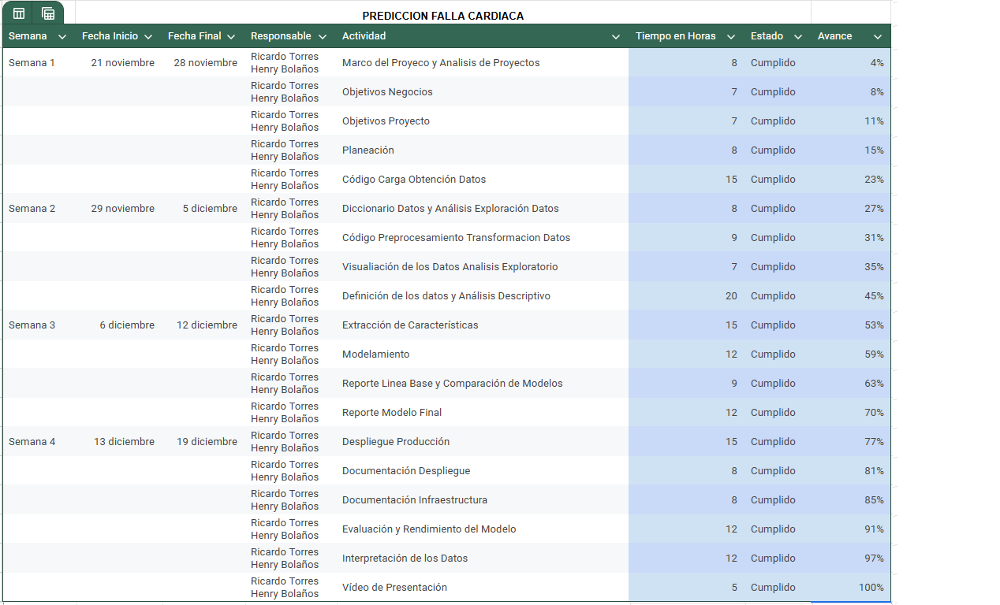

# Project Charter - Entendimiento del Negocio

## Nombre del Proyecto

[Nombre del proyecto aquí]

## Objetivo del Proyecto

[Descripción breve del objetivo del proyecto y por qué es importante]

## Alcance del Proyecto

### Incluye:

- [Descripción de los datos disponibles]
- [Descripción de los resultados esperados]
- [Criterios de éxito del proyecto]

### Excluye:

- [Descripción de lo que no está incluido en el proyecto]

## Metodología

[Descripción breve de la metodología que se utilizará para llevar a cabo el proyecto]

## Cronograma

## Equipo del Proyecto

- [Nombre y cargo del líder del proyecto]
- [Nombre y cargo de los miembros del equipo]

## Presupuesto

[Descripción del presupuesto asignado al proyecto]

## Stakeholders

- [Nombre y cargo de los stakeholders del proyecto]
- [Descripción de la relación con los stakeholders]
- [Expectativas de los stakeholders]

## Aprobaciones

- [Nombre y cargo del aprobador del proyecto]
- [Firma del aprobador]
- [Fecha de aprobación]
