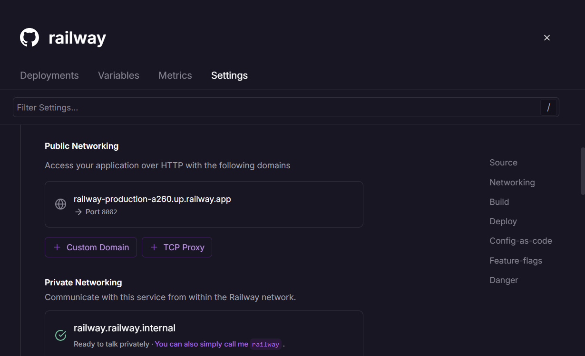
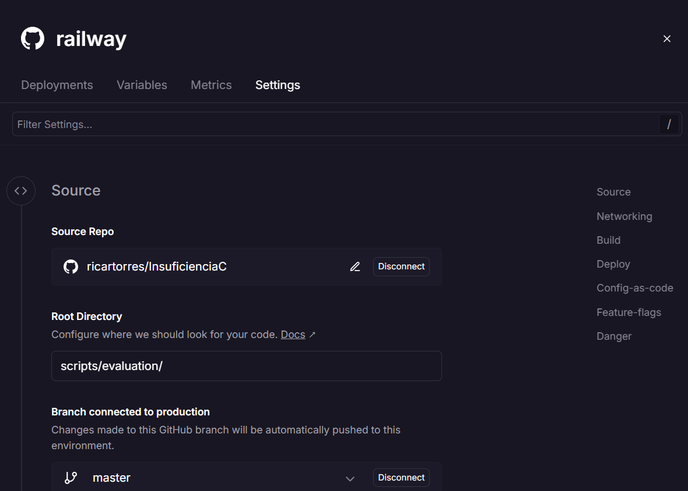
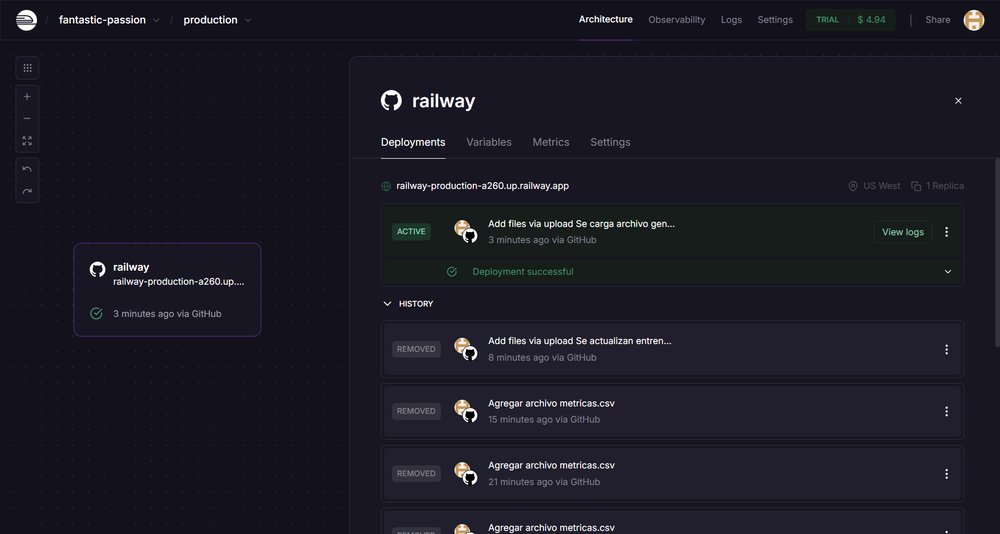

# Despliegue de modelos

## Infraestructura

**1. Plataforma de Despliegue**
- Plataforma: Railway
  - Railway es una plataforma de despliegue en la nube que permite ejecutar aplicaciones rápidamente, con soporte para servicios de backend como FastAPI.
  - Railway facilita el despliegue continuo integrándose con GitHub para automatizar el proceso desde el código hasta la API en producción.
  - Ofrece soporte para HTTPS y manejo de variables de entorno, esenciales para el despliegue seguro de un modelo.

**2. Requisitos Técnicos**

- Entorno de Programación
  - Lenguaje: Python 3.9 o superior.
  - Editor y entorno de desarrollo:
  - - Google Colab: Para el entrenamiento y desarrollo del modelo.
  - - GitHub: Para control de versiones y almacenamiento del código fuente.

- Bibliotecas y Dependencias
  - FastAPI: Para crear la API RESTful del modelo. Versión recomendada: 0.95.0 o superior.
  - Uvicorn: Para ejecutar el servidor de FastAPI. Versión: 0.22.0 o superior.
  - XGBoost: Para utilizar el modelo entrenado. Versión: 1.7.3 o superior.
  - Pandas: Para procesamiento de datos de entrada. Versión: 1.3.5 o superior.
  - Joblib: Para cargar el modelo previamente entrenado. Versión: 1.2.0 o superior.

- Hardware y Recursos
  - Servidor: Railway proporciona una infraestructura que no requiere configuración avanzada del servidor.
  - CPU: Suficiente para manejar peticiones simultáneas de la API.
  - RAM: Mínimo 1-2 GB, dependiendo del tamaño del modelo y tráfico esperado.
  - GPU (Opcional): No es necesario, ya que el modelo XGBoost no requiere GPU para inferencia.

**3. Requisitos de Seguridad**
Aunque en este caso no se implementará seguridad, a continuación se describen las mejores prácticas que se podrían aplicar si los usuarios son médicos en un hospital:

a) Autenticación:
- Implementar Token-Based Authentication usando OAuth2 o JWT (JSON Web Tokens).
- Cada médico tendría credenciales únicas para acceder a la API.

b) Cifrado de Datos (HTTPS):
- Utilizar HTTPS (obligatorio en Railway) para encriptar las comunicaciones entre clientes y servidor.
- Garantiza la confidencialidad de los datos de entrada y salida.

c) Control de Accesos:
- Implementar permisos basados en roles (RBAC) para asegurar que solo médicos autorizados puedan acceder a la API.

d) Protección de Datos Sensibles:
- Aplicar anonimización de datos si se manejan identificadores personales de pacientes.

e) Monitoreo y Logs:
- Implementar monitoreo de acceso a la API para detectar intentos no autorizados.
- Mantener registros cifrados de solicitudes y respuestas.

**4. Diagrama de Arquitectura**
La siguiente descripción ilustra el flujo de datos y el sistema para el despliegue del modelo:

a) Entrenamiento del Modelo:
- Se realiza en Google Colab utilizando el dataset de Kaggle.
- El modelo final entrenado (XGBoost classifier) se guarda como archivo serializado usando joblib.

b) Repositorio de Código:
- El código fuente, el modelo y las dependencias se almacenan en GitHub.

c) Despliegue de la API:
- La API se implementa usando FastAPI y se ejecuta en Uvicorn.
- Railway despliega la aplicación automáticamente desde el repositorio de GitHub.

d) Acceso a la API:
- Los médicos del hospital accederán a la API a través de un cliente HTTP (e.g., Postman o aplicaciones frontend).
- Las solicitudes y respuestas se transmiten de manera segura mediante HTTPS.

**5. Resumen del Despliegue**
- Plataforma: Railway
- Framework: FastAPI
- Modelo: XGBoost classifier (desempeño óptimo)
- Seguridad: HTTPS; autenticación sugerida (OAuth2/JWT)
- Infraestructura: Google Colab (entrenamiento), GitHub (código fuente), Railway (API en producción).

## Código de despliegue

Código de despliegue para el modelo de XGBoost utilizando FastAPI y Railway como plataforma

**1. Archivo Principal**
- El archivo principal que contendrá el código para el despliegue de la API será: main.py

**2. Rutas de Acceso a los Archivos**
Teniendo presente que el modelo entrenado fue serializado y guardado con joblib, los archivos necesarios son:

a) Modelo entrenado:
- Archivo: xgboost_model.joblib
- Ruta de acceso: models/xgboost_model.joblib

b) Código principal (FastAPI):
- Archivo: main.py
- Ubicación en la raíz del proyecto.

c) Requisitos de dependencias:
- Archivo: requirements.txt
- Ubicación: en la raíz del proyecto.

**3. Variables de Entorno**
Railway permite el uso de variables de entorno para configuraciones dinámicas. Las variables necesarias son:
- MODEL_PATH: Ruta relativa al modelo entrenado.
- Ejemplo: models/xgboost_model.joblib
- HOST: Dirección donde se ejecutará la API (por defecto 0.0.0.0).
- PORT: Puerto donde se desplegará la API (Railway suele asignarlo dinámicamente).

**4. Código de Despliegue (main.py)**

**5. Archivo de Dependencias (requirements.txt)**
Este archivo lista las librerías necesarias para el despliegue:
- fastapi==0.95.0
- uvicorn==0.22.0
- joblib==1.2.0
- pandas==1.3.5
- xgboost==1.7.3

**6. Configuración de Railway**
Railway asigna dinámicamente un puerto, por lo que el servidor debe ejecutarse de la siguiente manera:
- uvicorn main:app --host 0.0.0.0 --port ${PORT}
- el puerto seleccionado fue el 8082

**Configuración de Variables de Entorno y parametros settings en Railway:**
- Accede al panel de Railway → Configuración → Variables de entorno.
- Agrega lo siguiente: MODEL_PATH=models/xgboost_model.joblib

**Estructura de Archivos del Proyecto**
El proyecto debe tener la siguiente estructura:heart_failure_api/
│

├── main.py                   # Código principal de la API

├── models/

│   └── xgboost_model.joblib  # Modelo entrenado guardado

├── requirements.txt          # Dependencias del proyecto

├── .gitignore                # Ignorar archivos innecesarios

└── README.md                 # Documentación básica del proyecto

**Prueba Local de la API**
1. Ejecuta el servidor localmente usando Uvicorn: uvicorn main:app --reload

2. Abre tu navegador en http://127.0.0.1:8000/ para acceder a la ruta principal.

3. Accede a la documentación interactiva en http://127.0.0.1:8000/docs para probar el endpoint /predict.

**Resumen**
- Archivo Principal: main.py
- Rutas de Archivos:
  - Modelo entrenado: models/xgboost_model.joblib
  - Código principal: main.py
  - Dependencias: requirements.txt
- Variables de Entorno:
  - MODEL_PATH: Ruta del modelo.
  - PORT: Puerto de ejecución (parametrizado en Railway).

## Documentación del despliegue

**1. Instrucciones de Instalación**
Estas instrucciones detallan cómo instalar la API de predicción del modelo XGBoost classifier en Railway:

a) Clonar el repositorio desde GitHub:
- Abre tu terminal y clona el repositorio que contiene el código y el modelo:
  - git clone https://github.com/usuario/heart_failure_api.git
  - cd heart_failure_api

b) Crear el entorno virtual (opcional, pero recomendado):
Se recomienda crear un entorno virtual para evitar conflictos entre dependencias:
- python3 -m venv venv
- source venv/bin/activate  # En Linux/Mac
- venv\Scripts\activate     # En Windows

c)  Instalar las dependencias:
Ejecuta el siguiente comando para instalar las bibliotecas necesarias: pip install -r requirements.txt

d) Verificar la estructura del proyecto:
La estructura de archivos es la siguiente:

heart_failure_api/

├── main.py               # Código principal de la API

├── models/

│   └── xgboost_model.joblib  # Modelo entrenado

├── requirements.txt      # Dependencias

└── README.md             # Documentación básica

e) Probar el servidor localmente (opcional):
* Antes del despliegue en Railway, verifica que la API funcione localmente: uvicorn main:app --reload
* Abre tu navegador en http://127.0.0.1:8000/docs para interactuar con la API.

**2. Instrucciones de Configuración**
Para desplegar la API en Railway, sigue estos pasos:

a) Configurar el proyecto en Railway:
- Ve a la plataforma Railway: https://railway.app.
- Inicia sesión con tu cuenta de GitHub.
- Selecciona New Project → Deploy from GitHub Repo.
- Conecta tu repositorio clonado (heart_failure_api).

b) Agregar variables de entorno:
- En la sección de Environment Variables de Railway, agrega la siguiente variable: MODEL_PATH=models/xgboost_model.joblib

c) Configuración del servidor:
- Railway asigna dinámicamente el puerto, por lo que no necesitas definirlo manualmente.
- Asegúrate de que main.py use la variable PORT proporcionada por Railway.

d) Desplegar la API:
- Railway detectará automáticamente el archivo main.py y ejecutará el servidor con:
  - uvicorn main:app --host 0.0.0.0 --port ${PORT}
 
e) Verificar el despliegue:
- Una vez completado el despliegue, Railway proporcionará una URL pública.
- Accede a https://<tu-app>.railway.app/docs para verificar la documentación de la API.

**3. Instrucciones de Uso**

a) Acceder a la API
- La API expone dos rutas principales:
- Ruta de bienvenida (GET):
  - URL: https://<tu-app>.railway.app/
  - Descripción: Devuelve un mensaje de bienvenida.
  - Ejemplo de respuesta
   
-    {
-  "message": "Bienvenido a la API de Predicción de Insuficiencia Cardíaca - XGBoost"
-    }

b) Ruta de predicción (POST):
- URL: https://<tu-app>.railway.app/predict
- Descripción: Recibe los datos del paciente y devuelve una predicción.
- Formato de entrada (JSON)

- {
  - "age": 65,
  - "anaemia": 0,
  - "creatinine_phosphokinase": 120,
  - "diabetes": 1,
  - "ejection_fraction": 45,
  - "high_blood_pressure": 0,
  - "platelets": 250000.0,
  - "serum_creatinine": 1.2,
  - "serum_sodium": 137,
  - "sex": 1,
  - "smoking": 1,
  - "time": 120
- }

- Ejemplo de Respuesta
- {
  - "prediction": 1,
  - "result": "Fallecimiento"
- }

- Parámetros:
  - prediction: Clase predicha (0 = No Fallecimiento, 1 = Fallecimiento).
  - result: Interpretación legible del resultado.
 
  
Documentación de Despliegue - Instrucciones para el Usuario
1. Instrucciones de Instalación
Estas instrucciones detallan cómo instalar la API de predicción del modelo XGBoost classifier en Railway:

Clonar el repositorio desde GitHub:
Abre tu terminal y clona el repositorio que contiene el código y el modelo:

bash
Copiar código
git clone https://github.com/usuario/heart_failure_api.git
cd heart_failure_api
Crear el entorno virtual (opcional, pero recomendado):
Se recomienda crear un entorno virtual para evitar conflictos entre dependencias:

bash
Copiar código
python3 -m venv venv
source venv/bin/activate  # En Linux/Mac
venv\Scripts\activate     # En Windows
Instalar las dependencias:
Ejecuta el siguiente comando para instalar las bibliotecas necesarias:

bash
Copiar código
pip install -r requirements.txt
Verificar la estructura del proyecto:
Asegúrate de que la estructura de archivos sea la siguiente:

plaintext
Copiar código
heart_failure_api/
├── main.py               # Código principal de la API
├── models/
│   └── xgboost_model.joblib  # Modelo entrenado
├── requirements.txt      # Dependencias
└── README.md             # Documentación básica
Probar el servidor localmente (opcional):
Antes del despliegue en Railway, verifica que la API funcione localmente:

bash
Copiar código
uvicorn main:app --reload
Abre tu navegador en http://127.0.0.1:8000/docs para interactuar con la API.
2. Instrucciones de Configuración
Para desplegar la API en Railway, sigue estos pasos:

Configurar el proyecto en Railway:

Ve a la plataforma Railway: https://railway.app.
Inicia sesión con tu cuenta de GitHub.
Selecciona New Project → Deploy from GitHub Repo.
Conecta tu repositorio clonado (heart_failure_api).
Agregar variables de entorno:
En la sección de Environment Variables de Railway, agrega la siguiente variable:

plaintext
Copiar código
MODEL_PATH=models/xgboost_model.joblib
Configuración del servidor:
Railway asigna dinámicamente el puerto, por lo que no necesitas definirlo manualmente.
Asegúrate de que main.py use la variable PORT proporcionada por Railway.

Desplegar la API:
Railway detectará automáticamente el archivo main.py y ejecutará el servidor con:

bash
Copiar código
uvicorn main:app --host 0.0.0.0 --port ${PORT}
Verificar el despliegue:

Una vez completado el despliegue, Railway proporcionará una URL pública.
Accede a https://<tu-app>.railway.app/docs para verificar la documentación de la API.
3. Instrucciones de Uso
Acceder a la API
La API expone dos rutas principales:
Ruta de bienvenida (GET):

URL: https://<tu-app>.railway.app/
Descripción: Devuelve un mensaje de bienvenida.
Ejemplo de respuesta:
json
Copiar código
{
  "message": "Bienvenido a la API de Predicción de Insuficiencia Cardíaca - XGBoost"
}
Ruta de predicción (POST):

URL: https://<tu-app>.railway.app/predict
Descripción: Recibe los datos del paciente y devuelve una predicción.
Formato de entrada (JSON):
json
Copiar código
{
  "age": 65,
  "anaemia": 0,
  "creatinine_phosphokinase": 120,
  "diabetes": 1,
  "ejection_fraction": 45,
  "high_blood_pressure": 0,
  "platelets": 250000.0,
  "serum_creatinine": 1.2,
  "serum_sodium": 137,
  "sex": 1,
  "smoking": 1,
  "time": 120
}
Ejemplo de Respuesta:
json
Copiar código
{
  "prediction": 1,
  "result": "Fallecimiento"
}
Parámetros:
prediction: Clase predicha (0 = No Fallecimiento, 1 = Fallecimiento).
result: Interpretación legible del resultado.

**4. Instrucciones de Mantenimiento**
Para mantener el modelo y la API desplegada, se deben realizar las siguientes tareas periódicamente:

a) Actualizar el Modelo:
- Si el modelo se reentrena con nuevos datos, guarda el nuevo modelo en la misma ruta:
models/xgboost_model.joblib.
- Sube los cambios al repositorio de GitHub y Railway desplegará automáticamente la nueva versión.

b) Actualizar Dependencias:
- Si se actualizan bibliotecas en requirements.txt, Railway detectará los cambios y reinstalará las dependencias.
- Comando para actualizar localmente:
  - pip freeze > requirements.txt
  -

c) Monitorear el Desempeño:
- Utiliza herramientas como Railway Logs para monitorear las solicitudes y el rendimiento.
- Verifica posibles errores en la respuesta de la API.

d) Pruebas Periódicas:
- Realiza pruebas de la API después de cada actualización para garantizar su funcionamiento correcto.
- sa herramientas como Postman o scripts automatizados.

e) Seguridad:
- Asegúrate de que la API utilice HTTPS (Railway lo implementa por defecto).
- Si es necesario, habilita autenticación en futuras actualizaciones.

f) Respaldo de Datos y Modelo:
- Guarda copias de seguridad del modelo entrenado y los datos históricos en un repositorio seguro o almacenamiento en la nube.

**Resumen Final**
- Instalación: Clonar repositorio, instalar dependencias y probar localmente.
- Configuración: Configurar variables de entorno y desplegar en Railway.
- Uso: Utilizar las rutas / (bienvenida) y /predict (predicción).
- Mantenimiento: Actualizar modelo y dependencias, monitorear logs y garantizar el respaldo de información.
