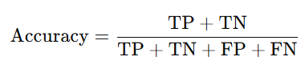
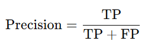
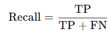
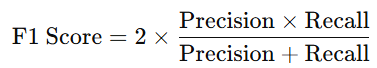
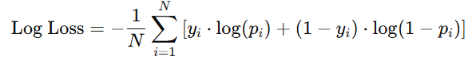
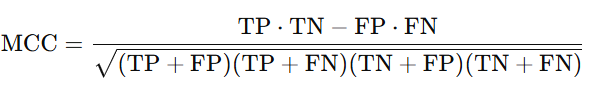
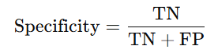
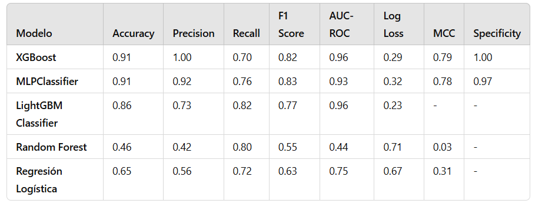
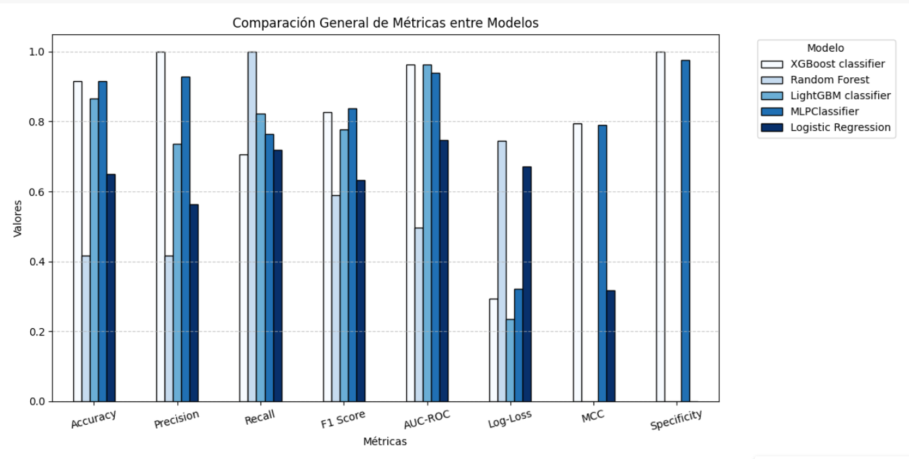

# Reporte del Modelo Baseline

Este documento contiene los resultados de los modelos entrenados.

## Descripción de los modelos

1. XGBoost
XGBoost (Extreme Gradient Boosting) es un algoritmo basado en árboles de decisión que utiliza un enfoque de ensamble para mejorar la precisión del modelo. Se construyen varios árboles de decisión de manera secuencial, y cada nuevo árbol intenta corregir los errores cometidos por los árboles anteriores. Este modelo es altamente eficiente, y es muy utilizado en competencias de machine learning debido a su capacidad para manejar tanto datos lineales como no lineales. Además, XGBoost es conocido por su velocidad y precisión, y es particularmente útil para grandes volúmenes de datos.

2. MLPClassifier (Perceptrón Multicapa)
El MLPClassifier es un tipo de red neuronal que utiliza múltiples capas de perceptrones para procesar datos de entrada y realizar clasificaciones. Este modelo es capaz de aprender patrones complejos en los datos, lo que lo hace adecuado para problemas no lineales. A diferencia de los árboles de decisión, las redes neuronales pueden capturar relaciones más complejas entre las características de entrada. El MLPClassifier se entrena utilizando el algoritmo de retropropagación y es muy flexible en cuanto a la arquitectura de las redes neuronales.

3. LightGBM
LightGBM (Light Gradient Boosting Machine) es otro algoritmo basado en boosting, pero se diferencia de XGBoost en que es más rápido y consume menos memoria. Utiliza una técnica de histogramas para reducir el costo computacional, lo que lo hace eficiente con grandes volúmenes de datos. LightGBM es particularmente útil para problemas en los que se manejan grandes conjuntos de datos y se necesitan tiempos de entrenamiento rápidos.

4. Random Forest
Random Forest es un modelo de ensamble que utiliza múltiples árboles de decisión para mejorar la precisión general del modelo. Cada árbol en el bosque es entrenado en un subconjunto aleatorio de los datos, y luego se realiza una votación para determinar la predicción final. Este enfoque ayuda a reducir el sobreajuste, haciendo que el modelo sea robusto incluso con datos ruidosos.

5. Regresión Logística
La regresión logística es un modelo de clasificación binaria que estima la probabilidad de que una entrada pertenezca a una clase específica. Este modelo es muy simple y eficiente para problemas de clasificación, pero generalmente tiene un rendimiento inferior cuando los datos no son lineales.

## Variables de entrada

Lista de las variables de entrada utilizadas en el modelo.

- time
- ejection_fraction
- serum_creatinine

## Variable objetivo

Nombre de la variable objetivo utilizada en el modelo.

- DEATH_EVENT

## Evaluación del modelo

### Métricas de evaluación

Descripción de las métricas utilizadas para evaluar el rendimiento del modelo.

#### 1. Accuracy
Mide la proporción de predicciones correctas sobre el total de predicciones realizadas. Es decir, cuántas veces el modelo acertó entre todos los casos.

- Formula:

  TP = Verdaderos positivos
  TN = Verdaderos negativos
  FP = Falsos positivos
  FN = Falsos negativos

- Interpretación:
  Una precisión del 100% indica que el modelo hizo todas las predicciones correctas, pero puede ser engañosa si las clases están desbalanceadas.

#### 2. Precision 
Mide la proporción de predicciones positivas correctas sobre todas las predicciones que el modelo hizo como positivas. Es útil cuando el costo de un falso positivo es alto.

- Formula:
  
- Interpretación:
   Una alta precisión significa que cuando el modelo predice positivo, es muy probable que esté en lo cierto. Se usa cuando es más importante evitar que un falso positivo ocurra.

#### 3. Recall  
Mide la proporción de casos positivos reales que el modelo fue capaz de identificar correctamente. Es útil cuando el costo de un falso negativo es alto.

- Formula:
  
- Interpretación:
   Un alto recall significa que el modelo es bueno para identificar casos positivos, incluso si a veces comete falsos positivos. Es crítico en situaciones donde perder casos positivos (falsos negativos) tiene consecuencias graves.

#### 4. F1 Score  
Es el promedio armónico entre la precisión y el recall, y se utiliza cuando es necesario un balance entre ambos. Un puntaje F1 alto indica que tanto la precisión como el recall son buenos.

- Formula:
  
- Interpretación:
   El F1 es particularmente útil cuando se enfrentan a datos desbalanceados (más instancias de una clase que de otra) y cuando tanto los falsos positivos como los falsos negativos tienen un impacto significativo.

#### 5. AUC-ROC  
Mide la capacidad del modelo para distinguir entre las clases, calculando el área bajo la curva ROC (Receiver Operating Characteristic), que es un gráfico que muestra la tasa de verdaderos positivos frente a la tasa de falsos positivos.

- Interpretación:
  Un AUC cercano a 1 indica que el modelo tiene una buena capacidad para diferenciar entre las clases. Un AUC de 0.5 indica que el modelo no tiene capacidad predictiva mejor que el azar.

#### 6. Log Loss  
Evalúa la calidad de las probabilidades de predicción del modelo, penalizando las predicciones incorrectas con mayor severidad. Se usa principalmente en problemas de clasificación probabilística.

- Formula:
  yi es el valor real de la clase (0 o 1)
  𝑝𝑖 es la probabilidad pronosticada de la clase positiva
  
- Interpretación:
  Un Log Loss bajo indica que las probabilidades predichas están cerca de los valores reales. Un valor alto indica que las probabilidades predichas están alejadas de la realidad, lo que refleja un modelo menos confiable.

#### 7. Matthews Correlation Coefficient (MCC)
Mide la calidad de la clasificación binaria teniendo en cuenta todos los elementos de la matriz de confusión (verdaderos positivos, falsos positivos, verdaderos negativos y falsos negativos). Es una métrica equilibrada que es adecuada incluso para conjuntos de datos desbalanceados.

- Formula:

- Interpretación:
  Un valor de MCC cercano a 1 indica una excelente clasificación, mientras que valores cercanos a -1 indican una clasificación completamente incorrecta, y 0 sugiere que el modelo no tiene una relación significativa con la variable de salida.
  
#### 8. Specificity 
Mide la capacidad del modelo para identificar correctamente los casos negativos (es decir, evitar falsos positivos). Es lo contrario al recall, pero enfocado en los negativos.

- Formula:

- Interpretación:
  Una alta especificidad significa que el modelo es bueno para identificar los casos negativos correctamente, evitando que las instancias negativas sean clasificadas erróneamente como positivas. Es importante cuando los falsos positivos tienen consecuencias graves.

### Resultados de evaluación

Tabla que muestra los resultados de las metricas de evaluación de los modelos 

## Análisis de los resultados

1. XGBoost

- Fortalezas: El modelo XGBoost muestra una precisión perfecta (1.00), lo que sugiere que es extremadamente efectivo para identificar los casos positivos. El AUC-ROC de 0.96 indica que el modelo tiene una excelente capacidad de discriminación entre las clases. Además, el MCC de 0.79 es alto, lo que refleja un buen desempeño general del modelo en términos de balance entre las clases.

- Debilidades: Aunque la precisión es muy alta, el recall de 0.70 indica que el modelo tiene dificultades para identificar todos los casos positivos. El log loss es relativamente bajo (0.29), lo que sugiere que el modelo realiza predicciones razonablemente confiables, pero podría mejorarse en términos de la estimación de probabilidades.
  
2. MLPClassifier (Perceptrón Multicapa)

- Fortalezas: El modelo tiene un excelente rendimiento en términos de precisión (0.92) y recall (0.76), lo que indica que es efectivo tanto para identificar correctamente los positivos como para minimizar los falsos negativos. Además, el AUC-ROC de 0.93 es una señal de que el modelo puede discriminar bien entre las clases.
- Debilidades: Aunque el modelo muestra un buen rendimiento general, el log loss es relativamente alto (0.32), lo que sugiere que las predicciones probabilísticas no son tan precisas. Además, la diferencia entre precisión y recall indica que puede haber algunos problemas con la identificación de todos los casos positivos.
   
3. LightGBM
- Fortalezas: LightGBM tiene un AUC-ROC muy alto (0.96), lo que indica una excelente capacidad de discriminación entre las clases. También presenta un log loss muy bajo (0.23), lo que refleja predicciones confiables.
- Debilidades: Aunque el modelo tiene un buen recall (0.82), su precisión es menor (0.73), lo que sugiere que el modelo predice un mayor número de falsos positivos.

4. Random Forest

- Fortalezas: El modelo tiene un recall alto (0.80), lo que significa que tiene una buena capacidad para identificar casos positivos.
- Debilidades: La precisión y AUC-ROC son muy bajas, lo que sugiere que el modelo está cometiendo muchos falsos positivos. Además, el log loss es muy alto (0.71), lo que refleja predicciones poco confiables.
   
5. Regresión Logística

- Fortalezas: La regresión logística muestra un buen rendimiento en términos de recall (0.72), lo que indica que el modelo es efectivo para identificar los casos positivos.
- Debilidades: La precisión y el AUC-ROC son relativamente bajos, lo que sugiere que el modelo no discrimina bien entre las clases. El log loss es alto, lo que refleja predicciones inexactas.

## Conclusiones

Conclusiones generales sobre el rendimiento del modelo baseline y posibles áreas de mejora.

1. XGBoost
Es un modelo robusto con excelentes resultados en términos de precisión y AUC-ROC. Sin embargo, el recall podría mejorarse para garantizar que se identifiquen más casos positivos. Este modelo es ideal para aplicaciones en las que la precisión es más importante que el recall.
   
2. MLPClassifier (Perceptrón Multicapa)

Muestra un excelente equilibrio entre precisión y recall, siendo adecuado para problemas en los que es crucial identificar correctamente los casos positivos sin perder demasiados. Su rendimiento en términos de AUC-ROC también es muy bueno.

3. LightGBM

Es un modelo eficiente y rápido, con un alto AUC-ROC. Sin embargo, su precisión podría mejorarse, especialmente en escenarios en los que la reducción de falsos positivos es crítica.
   
4. Random Forest

Aunque el modelo tiene un buen recall, su baja precisión y AUC-ROC indican que necesita ajustes significativos para mejorar su desempeño general.
   
5. Regresión Logística

La regresión logística es un modelo básico que, aunque adecuado para problemas simples, no es tan preciso como otros modelos más complejos como XGBoost o MLPClassifier.

- En conclusión, XGBoost emerge como el modelo más eficiente en términos generales debido a su alto AUC-ROC y su precisión perfecta, lo que lo hace ideal para tareas de clasificación binaria donde la discriminación entre clases es clave. No obstante, dependiendo de la aplicación específica, MLPClassifier y LightGBM también ofrecen ventajas, como un mejor balance entre precisión y recall, especialmente cuando el enfoque está en detectar todos los casos positivos sin importar tanto el costo de los falsos positivos.

## Referencias

- matplotlib:

Matplotlib es una biblioteca para la visualización de gráficos en Python. Es ampliamente utilizada para crear gráficos estáticos, animados e interactivos.
Referencia:
Hunter, J. D. (2007). Matplotlib: A 2D graphics environment. Computing in Science & Engineering, 9(3), 90-95.
DOI: 10.1109/MCSE.2007.55

- xgboost:
XGBoost es un algoritmo de aprendizaje automático basado en árboles de decisión, especialmente eficiente para clasificación y regresión.
Referencia:
Chen, T., & Guestrin, C. (2016). XGBoost: A scalable tree boosting system. Proceedings of the 22nd ACM SIGKDD International Conference on Knowledge Discovery and Data Mining, 785–794.
DOI: 10.1145/2939672.2939785

- colorama:
Colorama es una biblioteca que permite utilizar colores en la salida de la terminal o consola, mejorando la legibilidad de los mensajes.
Referencia:
Colorama Documentation. (2021). https://pypi.org/project/colorama/

- scikit-learn:
scikit-learn es una biblioteca de Python que proporciona herramientas para minería de datos y análisis de datos. Incluye varios algoritmos de aprendizaje automático y herramientas de evaluación de modelos.
Referencia:
Pedregosa, F., Varoquaux, G., Gramfort, A., Michel, V., Thirion, B., Grisel, O., ... & Duchesnay, É. (2011). Scikit-learn: Machine learning in Python. Journal of Machine Learning Research, 12, 2825-2830.
URL: https://scikit-learn.org/

- imblearn (imbalanced-learn):

imbalanced-learn es una biblioteca de Python para manejar conjuntos de datos desbalanceados mediante técnicas de sobremuestreo y submuestreo.
Referencia:
Lemaître, G., Nogueira, F., & Aridas, C. K. (2017). Imbalanced-learn: A Python toolbox to tackle the curse of imbalanced datasets in machine learning. Journal of Machine Learning Research, 18(1), 559-563.
URL: https://imbalanced-learn.org/

- mlxtend:

mlxtend es una biblioteca que ofrece una colección de extensiones útiles para scikit-learn, incluyendo visualización de matrices de confusión y otras herramientas.
Referencia:
Raschka, S., & Mirjalili, V. (2017). Python Machine Learning. Packt Publishing.
URL: https://rasbt.github.io/mlxtend/

- lightgbm:

LightGBM es una implementación eficiente de un algoritmo de aprendizaje basado en gradiente boosting para clasificación y regresión.
Referencia:
Ke, G., Meng, Q., Finley, T., Wang, T., Chen, W., & Ma, W. (2017). LightGBM: A highly efficient gradient boosting decision tree. Advances in Neural Information Processing Systems, 30.
URL: https://lightgbm.readthedocs.io/

- MLPClassifier (de scikit-learn):

MLPClassifier es un clasificador basado en redes neuronales multicapa (MLP) disponible en scikit-learn.
Referencia:
B. Schölkopf, A. Smola, et al. (2002). Learning with Kernels: Support Vector Machines, Regularization, Optimization, and Beyond. MIT Press.
URL: https://scikit-learn.org/stable/modules/neural_networks_supervised.html#mlpclassifier

- Accuracy:

Chicco, D., & Jurman, G. (2020). The advantages of the Matthews correlation coefficient (MCC) over F1 score and accuracy in binary classification evaluation. BMC Genomics, 21(1), 6.
DOI: 10.1186/s12864-019-6250-3

- Precision:

Powers, D. M. W. (2011). Evaluation: from precision, recall and F-measure to ROC, informedness, markedness & correlation. Journal of Machine Learning Technologies, 2(1), 37-63.
URL: https://arxiv.org/abs/2010.15948

- Recall:

Sokolova, M., & Lapalme, G. (2009). A systematic analysis of performance measures for classification tasks. Information Processing & Management, 45(4), 427-437.
DOI: 10.1016/j.ipm.2009.03.002

- F1 Score:

Van Rijsbergen, C. J. (1979). Information Retrieval (2nd ed.). Butterworths.
ISBN: 978-0408704132

- AUC-ROC:

Fawcett, T. (2006). An introduction to ROC analysis. Pattern Recognition Letters, 27(8), 861-874.
DOI: 10.1016/j.patrec.2005.10.010

- Log Loss:

Nogueira, M. (2020). Evaluation Metrics for Classification Algorithms. Springer.
ISBN: 978-3030289045

- Matthews Correlation Coefficient (MCC):

Matthews, B. W. (1975). Comparison of the predicted and observed binary classification rates: a new measure of the accuracy of predictions. Ecology, 56(1), 1-11.
DOI: 10.2307/1936166

- Specificity:

Powers, D. M. W. (2011). Evaluation: from precision, recall and F-measure to ROC, informedness, markedness & correlation. Journal of Machine Learning Technologies, 2(1), 37-63.
URL: https://arxiv.org/abs/2010.15948
