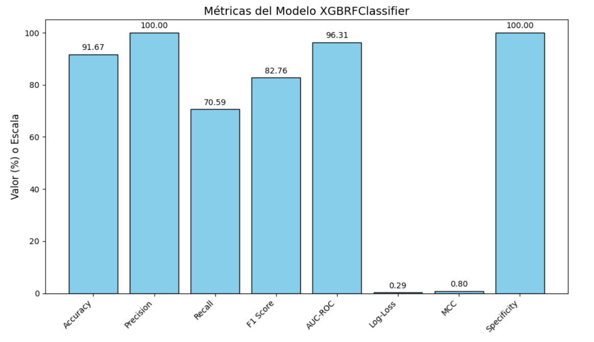
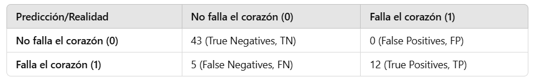
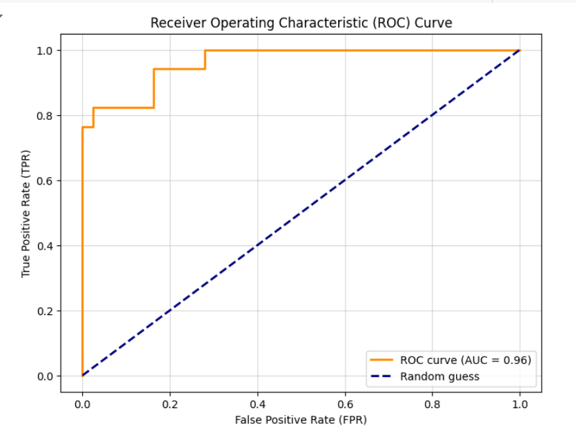

# Reporte del Modelo Final

## Resumen Ejecutivo

En esta sección se presenta un resumen de los resultados obtenidos del modelo XGBRFClassifier.
Este modelo predice eventos de muerte en pacientes con insuficiencia cardíaca y logró un desempeño destacado, con una precisión del 100%, un AUC-ROC de 96% y una exactitud general del 91.67%. Las métricas muestran un modelo robusto, especialmente en la clasificación de eventos positivos, aunque presenta ciertas limitaciones en la sensibilidad.

## Descripción del Problema

La insuficiencia cardíaca es una de las principales causas de mortalidad a nivel mundial. Este proyecto tiene como objetivo desarrollar un modelo predictivo capaz de identificar pacientes con mayor riesgo de muerte, utilizando datos clínicos clave. La identificación temprana de estos pacientes permite tomar decisiones oportunas que pueden mejorar la calidad de vida y reducir los índices de mortalidad.

El dataset utilizado contiene registros con información clínica de pacientes diagnosticados con insuficiencia cardíaca, y el objetivo principal es predecir si el paciente fallecerá o no (DEATH_EVENT) en función de variables como el tiempo de seguimiento, fracción de eyección y nivel de creatinina sérica.
En esta sección se describirá el problema que se buscó resolver con el modelo final. 

## Descripción del Modelo

El modelo final es un XGBRFClassifier, que combina árboles de decisión con características de aleatoriedad en la construcción de los bosques. Este modelo fue seleccionado por su capacidad para manejar datos desbalanceados y ofrecer interpretabilidad en escenarios clínicos.

Metodología:

- Selección de Características: 
Se utilizaron las variables time, ejection_fraction y serum_creatinine, seleccionadas por su relevancia clínica.
- Preprocesamiento:
Escalado con StandardScaler para normalizar las variables continuas.
Uso de SMOTE para balancear la distribución de clases en los datos de entrenamiento.
- Entrenamiento y Evaluación:
División del dataset en 80% entrenamiento y 20% prueba.
Ajuste del modelo utilizando los datos balanceados.
Evaluación mediante múltiples métricas para garantizar un análisis completo del desempeño.

## Evaluación del Modelo

Métricas Obtenidas:

Exactitud (Accuracy): 91.67%

Precisión: 100.00%

Sensibilidad (Recall): 70.59%

F1 Score: 82.76%

AUC-ROC: 96.00%

Log-Loss: 0.29

MCC (Matthews Correlation Coefficient): 0.80

Especificidad: 100.00%

El modelo muestra un desempeño sobresaliente en la clasificación de eventos negativos, pero la sensibilidad limitada indica que puede mejorar en la detección de casos positivos. La curva ROC (AUC = 0.96) destaca su capacidad general para discriminar entre clases.

Matriz de Confusión:
La matriz de confusión revela que el modelo clasifica correctamente todos los casos negativos, pero falla en algunos casos positivos.

Visualizaciones:
Curva ROC: Destaca un área bajo la curva del 96%, indicando una fuerte discriminación.
Gráfico de Métricas: Proporciona una visión comparativa de los indicadores clave.

## Conclusiones y Recomendaciones

- El modelo es altamente preciso y confiable para predecir eventos negativos (muerte no ocurrida).
- Las métricas indican una excelente especificidad, aunque existe margen de mejora en la sensibilidad.
- El uso de técnicas como SMOTE mejoró significativamente el balance de clases.
- Implementar el modelo en entornos clínicos con monitoreo constante para refinar los umbrales de decisión.
- Explorar técnicas adicionales para mejorar la sensibilidad, como la optimización de hiperparámetros o el ajuste de la función de costo.
- Evaluar la inclusión de nuevas características clínicas para mejorar la capacidad predictiva del modelo.

## Referencias

- Matplotlib
Hunter, J. D. (2007). Matplotlib: A 2D graphics environment. Computing in Science & Engineering, 9(3), 90-95.
Disponible en: https://matplotlib.org/

- XGBoost
Chen, T., & Guestrin, C. (2016). XGBoost: A Scalable Tree Boosting System. Proceedings of the 22nd ACM SIGKDD International Conference on Knowledge Discovery and Data Mining, 785–794.
Disponible en: https://xgboost.readthedocs.io/
https://xgboost.readthedocs.io/en/latest/

- Colorama
Tóth, J. (2010). Colorama: Simple cross-platform colored terminal text in Python.
Disponible en: https://pypi.org/project/colorama/

- Scikit-learn
Pedregosa, F., Varoquaux, G., Gramfort, A., Michel, V., Thirion, B., Grisel, O., Blondel, M., Prettenhofer, P., Weiss, R., Dubourg, V., Vanderplas, J., Passos, A., Cournapeau, D., Brucher, M., Perrot, M., & Duchesnay, É. (2011). Scikit-learn: Machine Learning in Python. Journal of Machine Learning Research, 12, 2825–2830.
Disponible en: https://scikit-learn.org/

- Imbalanced-learn (SMOTE)
Lemaître, G., Nogueira, F., & Aridas, C. K. (2017). Imbalanced-learn: A Python Toolbox to Tackle the Curse of Imbalanced Datasets in Machine Learning. Journal of Machine Learning Research, 18(17), 1-5.
Disponible en: https://imbalanced-learn.org/

- MLXtend
Raschka, S. (2018). MLXtend: Providing machine learning and data science utilities and extensions.
Disponible en: http://rasbt.github.io/mlxtend/

- Kaggle
Dataset utilizado URL: https://www.kaggle.com/datasets/andrewmvd/heart-failure-clinical-data 

- Artículo sobre SMOTE:  https://arxiv.org/abs/1106.1813
